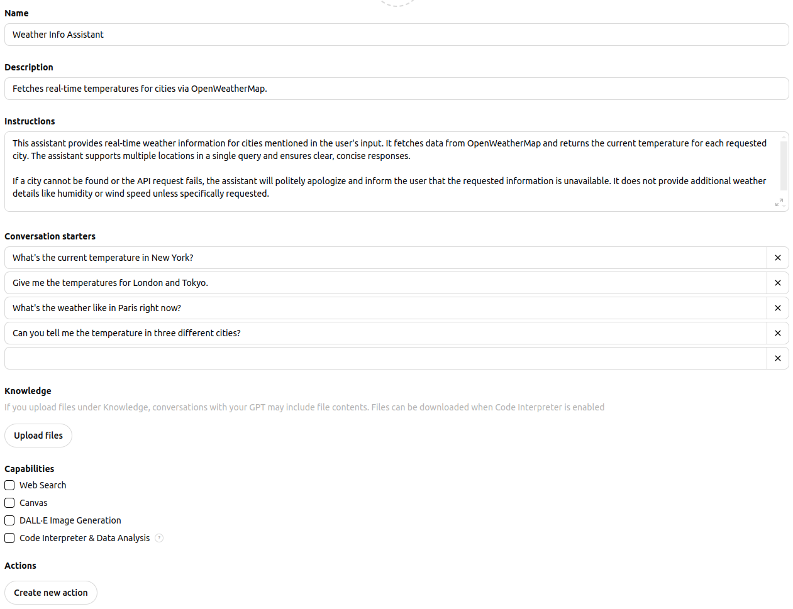
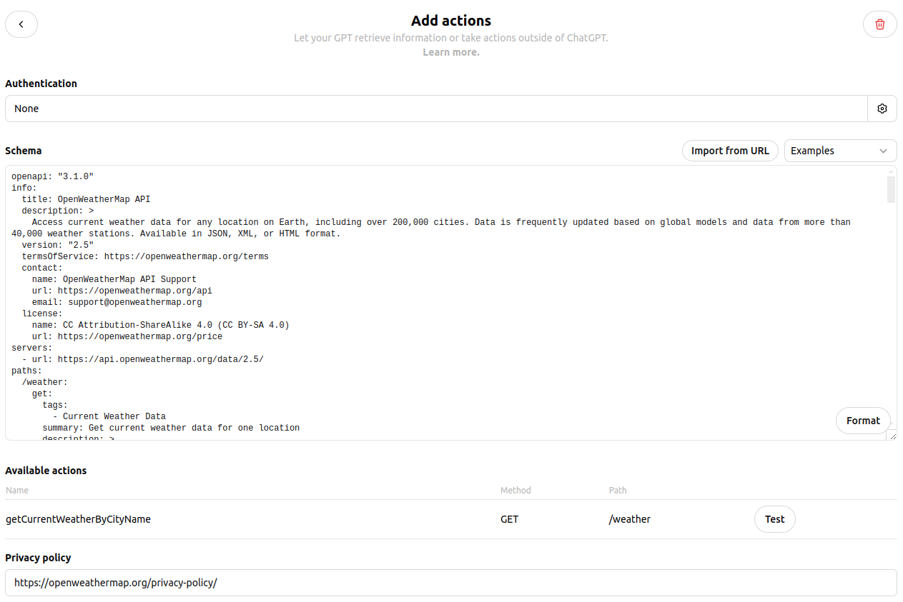
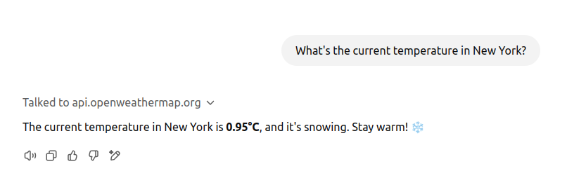
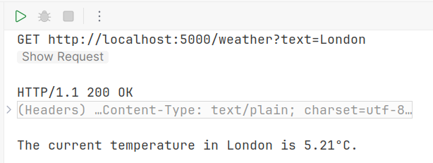

# Custom GPT using Semantic Kernel

## Introduction
The idea of this small learning project is to reproduce partially [Custom GPT](https://openai.com/index/introducing-gpts/) from OpenAI
using following technologies: 
* [Semantic Kernel, C#](https://github.com/microsoft/semantic-kernel)
* [AI SDK UI by Vercel, React](https://github.com/vercel/ai)
* [OpenWeather API](https://openweathermap.org/current)

## Scope of project
* Create Custom GPT for getting weather information about cities mentioned in user prompt using external tool calling 
> ChatGPT itself supports this functionality using `Web Search`, but it will "disabled" to prefer using external tooling
* Repeat same functionality using `Semantic Kernel`

## Weather API
[OpenWeather API](https://openweathermap.org/current) is an external weather API for this project. Registration and generation of API key is needed for running final version of exercise.

### OpenWeather API OpenAPI specification
I didn't find direct link for downloading OpenAPI specification on this page https://openweathermap.org/current,
so I decide to try to generate this file using ChatGPT.

Prompt:
```text
Please visit this page https://openweathermap.org/current and generate OpenAPI specification for requesting current weather by city name 
```
Result: 
[OpenAPI.yaml](./OpenWeatherAPI/OpenAPI.yaml)

## Custom GPT
### Basic configuration 
**Name**: Weather Info Assistant

**Instructions:**
```text
This assistant provides real-time weather information for cities mentioned in the user's input. It fetches data from OpenWeatherMap and returns the current temperature for each requested city. The assistant supports multiple locations in a single query and ensures clear, concise responses.

If a city cannot be found or the API request fails, the assistant will politely apologize and inform the user that the requested information is unavailable. It does not provide additional weather details like humidity or wind speed unless specifically requested.

The assistant prioritizes accuracy, ensuring that it correctly identifies cities and provides relevant temperature data based on OpenWeatherMap's API.
```

**Conversation starters:**
* What's the current temperature in New York?
* Give me the temperatures for London and Tokyo.
* What's the weather like in Paris right now?
* Can you tell me the temperature in three different cities?

**Capabilities**: all unchecked



### Create new action
To make [OpenAPI.yaml](./OpenWeatherAPI/OpenAPI.yaml) compatible with OpenAI schema validator:
* openapi: 3.0.1 -> openapi: "3.1.0"
* version: 2.5 -> version: "2.5"

`OpenWeather API` uses API key as query parameter, so we can not use standard authentication options from OpenAI
Here I found a workaround [API Key workaround: just make it a parameter](https://community.openai.com/t/api-key-workaround-just-make-it-a-parameter/580351)

```yaml
- name: appid
  in: query
  description: Your unique API key.
  required: true
  schema:
    type: string
    enum: [YOUR_API_KEY]
```
[OpenAPI.Fixed.yaml](./OpenWeatherAPI/OpenAPI.Fixed.yaml) (replace **YOUR_API_KEY** with real API key, don't use this approach in production)

**Privacy policy**: https://openweathermap.org/privacy-policy/



### Test


## Semantic Kernel
### Configuration
`Semantic Kernel` supports [plugins from OpenAPI specifications](https://learn.microsoft.com/en-us/semantic-kernel/concepts/plugins/adding-openapi-plugins?pivots=programming-language-csharp)

`Semantic Kernel` doesn't support OpenAPI 3.1.0
* openapi: "3.1.0" -> openapi: "3.0.0"

[OpenAPI.FixedSK.yaml](./OpenWeatherAPI/OpenAPI.FixedSK.yaml)

Configuration for `kernel`
```csharp
const string modelId = "gpt-4o-mini";
var openAiApiKey = Environment.GetEnvironmentVariable("OPENAI_API_KEY")!;
builder.Services.AddOpenAIChatCompletion(modelId, apiKey: openAiApiKey);

var openWeatherApiKey = Environment.GetEnvironmentVariable("OPENAI_WEATHER_API_KEY")!;
var openWeatherApiSpec = File.ReadAllText("OpenAPI.FixedSK.yaml").Replace("YOUR_API_KEY", openWeatherApiKey);
var kernelSingleton = Kernel.CreateBuilder().Build();
await kernelSingleton.ImportPluginFromOpenApiAsync(
    "OpenWeatherAPI",
    new MemoryStream(Encoding.UTF8.GetBytes(openWeatherApiSpec)),
#pragma warning disable SKEXP0040
    new OpenApiFunctionExecutionParameters(),
#pragma warning restore SKEXP0040
    CancellationToken.None);
builder.Services.AddSingleton(kernelSingleton);
```

Endpoint
```csharp
app.MapGet("/weather", async (string text, IChatCompletionService completionService, Kernel kernel,  CancellationToken token) =>
    {
        var chatHistory = new ChatHistory();
        chatHistory.AddSystemMessage("""
                                     This assistant provides real-time weather information for cities mentioned in the user's input. It fetches data from OpenWeatherMap and returns the current temperature for each requested city. The assistant supports multiple locations in a single query and ensures clear, concise responses.
                                     
                                     If a city cannot be found or the API request fails, the assistant will politely apologize and inform the user that the requested information is unavailable. It does not provide additional weather details like humidity or wind speed unless specifically requested.
                                     
                                     The assistant prioritizes accuracy, ensuring that it correctly identifies cities and provides relevant temperature data based on OpenWeatherMap's API.
                                     """);
        chatHistory.AddUserMessage(text);
        var response = await completionService.GetChatMessageContentsAsync(chatHistory, new OpenAIPromptExecutionSettings()
        {
            FunctionChoiceBehavior = FunctionChoiceBehavior.Auto()
        }, kernel, token);
        return response[0].Content;
    })
    .WithName("GetWeather")
    .WithOpenApi();
```

### Test


## AI SDK UI by Vercel
WIP


